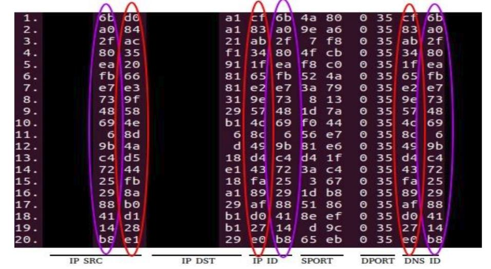
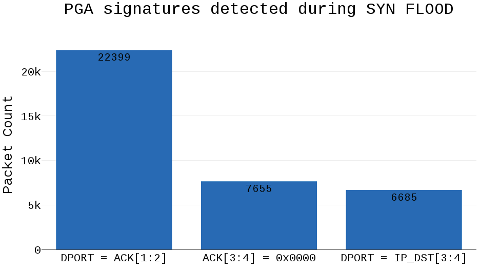

# PGA Filter

### Table of Contents
- [Introduction](#introduction)
  + [eBPF](#ebpf-extended-berkeley-packet-filter)
  + [XDP](#xdp-express-data-path)
  + [BCC](#bcc-bpf-compiler-collection)
  + [PGA](#pgafn-sissden-d5.3)
- [Prerequisites](#prerequisites)
- [Install](#install)
  + [Docker](#docker)
  + [Python package](#python-package)
  + [Manual](#manual)
- [GUARD](#guard)
- [Acknowledgement](#acknowledgement)

# Introduction

PGA Filter (Packet Generation Algorithm) is a software that leverages knowledge
of malware networking stack implementation. It inspects the traffic and detects
packets originating from botnets or other malicious software that were generaed
using PGAs. It uses PGA signatures extracted from darknet traffic observed by
Network Telescope deployed at NASK[^fn-nask] as a part of the SISSDEN[^fn-sissden]
project.

For traffic inspection this software employs [eBPF](https://ebpf.io/) +
[XDP](https://www.iovisor.org/technology/xdp) technology by the means of
[BCC](https://github.com/iovisor/bcc) toolkit that is a part of IO Visor
Project[^fn-iovisor].

## [eBPF](https://ebpf.io/) (extended Berkeley Packet Filter)

The Berkeley Packet Filter (BPF) is a technology used in certain computer
operating systems for programs that need to, among other things, analyze network
traffic. It provides a raw interface to data link layers, permitting raw
link-layer packets to be sent and received. It is available on most Unix-like
operating systems. In addition, if the driver for the network interface supports
promiscuous mode, it allows the interface to be put into that mode so that all
packets on the network can be received, even those destined to other hosts.

Since version 3.18, the Linux kernel includes an extended BPF virtual machine
with ten 64-bit registers, termed extended BPF (eBPF). It can be used for
non-networking purposes, such as for attaching eBPF programs to various
tracepoints. Since kernel version 3.19, eBPF filters can be attached to
sockets, and, since kernel version 4.1, to traffic control classifiers for
the ingress and egress networking data path. The original and obsolete
version has been retroactively renamed to classic BPF (cBPF). Nowadays, the
Linux kernel runs eBPF only and loaded cBPF bytecode is transparently translated
into an eBPF representation in the kernel before program execution. All
bytecode is verified before running to prevent denial-of-service attacks. Until
Linux 5.3, the verifier prohibited the use of loops.[^fn-wiki-bpf]

## [XDP](https://www.iovisor.org/technology/xdp) (eXpress Data Path)

XDP (eXpress Data Path) is an eBPF based high performance data path merged in
the Linux kernel since version 4.8.

The idea behind XDP is to add an early hook in the RX path of the kernel, and
let a user supplied eBPF program decide the fate of the packet. The hook is
placed in the NIC driver just after the interrupt processing, and before any
memory allocation needed by the network stack itself, because memory allocation
can be an expensive operation. Due to this design, XDP can drop 26 millions of
packets per second per core with commodity hardware.[^fn-wiki-xdp]

## [BCC](https://github.com/iovisor/bcc) (BPF Compiler Collection) 

> BCC is a toolkit for creating efficient kernel tracing and manipulation
> programs, and includes several useful tools and examples. It makes use of
> extended BPF (Berkeley Packet Filters), formally known as eBPF, a new feature
> that was first added to Linux 3.15. Much of what BCC uses requires Linux 4.1 and
> above.[^fn-github-bcc]

## PGA (Packet Generation Algorithm)

Malware, botnets or potentially malicious tools (like scanners) often utilize
different packet generation algorithms, in order to simplify packet generation
procedure or make it more performant[^fn-sissden-d5.3]. These procedures are
usually based on some simple operations, for example:

* byte swapping,
* value increment,
* value hardcoding.

These signatures can be usually spotted in the scanning or DoS traffic. Figure
bellow presents an example of a PGA signature in DNS traffic (scanning) observed
in the NASK darknet. 

*Example of PGA signatures in DNS traffic observed in the NASK darknet*

It can be easily spotted that three particular fields are connected with each
other: Source IP address, IP ID and DNS ID. All of 20 presented network packets
have following signatures in IP and DNS protocols headers:

* `IP_ID = DNS_ID`
* `IP_ID[1] + 1 = IP_SRC[4]`
* `DNS_ID[1] + 1 = IP_SRC[4]`
* `IP_ID[4] = IP_SRC[3]`
* `DNS_ID[4] = IP_SRC[3]`

PGA-based botnet fingerprinting operates mainly on the darknet traffic. A custom
system was developed from scratch to analyze protocol headers in network packets
and identify relations between particular bytes in those headers. Consequently,
it allows to apply such rules for the analysis of malicious traffic and, in some
cases, even perform attribution of attacks, for example: which botnet is
responsible for scanning or exploitation or which group is responsible for a
particular Denial of Service attack.  The plot presents an example of PGA
signatures matched during DoS attacks targeting one of Google IP addresses.
These signatures were observed in backscatter from a SYN flood attack, thus were
detected in `TCP SYN-ACK` packets.

*Signatures in SYN-ACK packets originating from a SYN flood DoS attack*

As these signatures were visible in server responses, they can be easily
transformed to signatures that could have been observed in original SYN packets
used for flooding:

* `SYN-ACK: DPORT = ACK[1:2] → SYN: SPORT = SEQ[1:2]`
* `SYN-ACK: ACK[3:4] = 0x0000 → SYN: SEQ[3:4] = 0xFFFF`
* `SYN-ACK: DPORT = IP_DST[3:4] → SYN: SPORT = IP_SRC[3:4]`

Knowing that this attack was performed with three above mentioned signatures, it
is possible to link this particular attack with others using the same technique.
To sum up, PGA module allows to create new signatures based on header-level
characteristics of network attacks and facilities attribution actions (detection
of tools or malware).
    
# Prerequisites
- *Linux kernel version 4.1* (or newer). **This is an essential requirement!**
  Software relies on the Linux kernel's eBPF support. For more information about 
  kernel requirements and configuration see the BCC installation
  [documentation](https://github.com/iovisor/bcc/blob/master/INSTALL.md).
- *Python 3.7* (or newer) or *Docker* (depends on the installation)
- *Root privileges* are required to load BPF program (or run privileged Docker
  container)

# Install
There are few installation options that are described bellow.
From the least to the most involved one.

**WARNING!** Make sure that requirements described in
[prerequisites](#prerequisites)  section are satisfied.

## Docker
Work in progress

## Python package
Work in progress

## Manual installation
TODO

# Usage
TODO

## Configuration
TODO

## Rules
TODO

# GUARD
PGA Filter as a part of the GUARD Project[^fn-guard] intended to be deployed as an
agent (GUARD Agent) on the host system . The instruction on how to integrate 
PGA Filter in the GUARD Platform can be found [here](./doc/guard.md).

# Acknowledgement
This software was created as a part of the GUARD Project[^fn-guard] founded by
the EU's Horizon2020[^fn-horizon2020] programme under agreement number 833456

# References

[^fn-wiki-bpf]: [Wikipedia: Berkeley Packet Filter (BPF)](https://en.wikipedia.org/wiki/Berkeley_Packet_Filter)
(accessed March 23, 2021)

[^fn-wiki-xdp]: [Wikipedia: Express Data Path (XDP)](https://en.wikipedia.org/wiki/Express_Data_Path)
(accessed March 23, 2021)

[^fn-iovisor]: [IO Visor Project (iovisor)](https://www.iovisor.org/)

[^fn-nask]: [Research and Academic Computer Network (NASK)](https://nask.pl/)

[^fn-sissden]: [Secure Information Sharing Sensor Delivery Event Network (SISSDEN)](https://sissden.eu/)

[^fn-sissden-d5.3]: SISSDEN, Deliverable D5.3: Final data analysis results, 2.2.3 PGA-based Botnet fingerprinting - 
[PDF](https://ec.europa.eu/research/participants/documents/downloadPublic?documentIds=080166e5b622cb17&appId=PPGMS)
(accessed March 23, 2021)

[^fn-guard]: [GUARD](https://guard-project.eu/) - a cybersecurity framework to
guarantee reliability and trust for digital service chains 

[^fn-horizon2020]: [Horizon 2020](https://ec.europa.eu/programmes/horizon2020) -
the financial instrument implementing the Innovation Union, a Europe 2020
flagship initiative aimed at securing Europe's global competitiveness.

<!---

[//]: # (Local Variables:)
[//]: # (ispell-local-dictionary: "american")
[//]: # (End:)

-->

